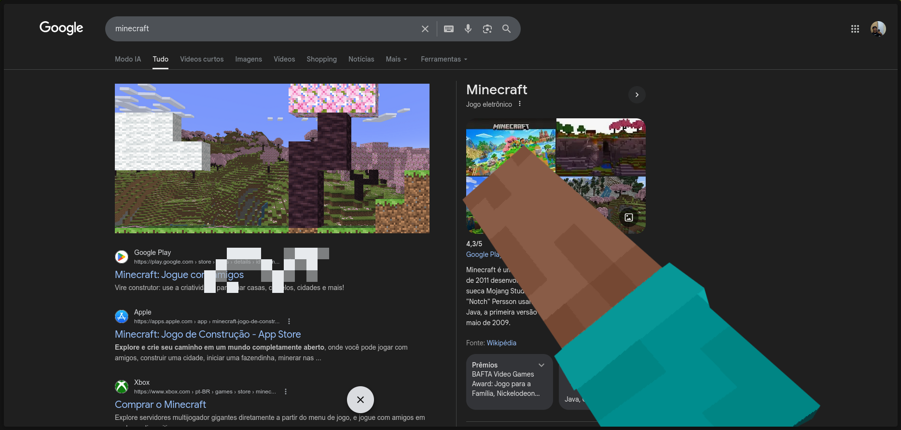
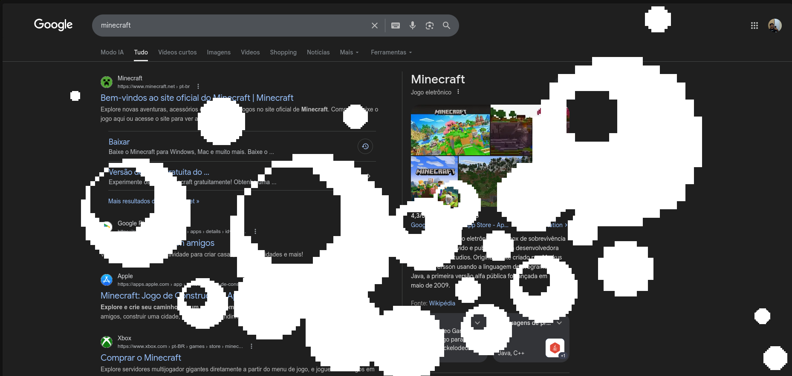

# 🕹️ Minecraft e mais: O Google escondeu um "arcade" na sua busca

> O Google Search deixou de ser apenas uma ferramenta de busca para se tornar um playground interativo. Recentemente, um Easter Egg de Minecraft viralizou ao permitir que os usuários minerem os resultados da pesquisa com a picareta do Steve. Mas a diversão não para por aí! De infecções por fungos de The Last of Us a naves da NASA colidindo com a sua tela, exploramos como o Google está homenageando a cultura pop e os games. Neste guia, mostramos o passo a passo para você ativar cada um desses segredos e transformar sua navegação em uma experiência muito mais divertida.

`Google Easter Eggs`, `Minecraft no Google`, `Segredos do Google`, `Como jogar Minecraft no Google`, `Easter Eggs de Games`, `Dicas de Google Search`, `Sonic Google Easter Egg`, `The Last of Us Google`, `Curiosidades Tech `, `Google Interativo`, `Dicas de Games`, `Nostalgia Minecraft`

Fala, arqueiro!

Se você usa o Google só pra debugar código ou tirar dúvida rápida, está perdendo a melhor parte da semana. A última atualização deles transformou os resultados de pesquisa em um verdadeiro playground, e o Minecraft é a estrela do show (mas não a única).
⛏️ Steve invadiu o seu navegador

Se você digitar "Minecraft" agora, vai notar um bloco de grama suspeito no rodapé da página. Clicar nele é um caminho sem volta: seu cursor vira a mão do Steve e você começa a destruir a página de pesquisa.

Dá pra minerar os links, abrir buracos nas fotos e "cavar" até encontrar diamantes ou cair na lava. É aquele tipo de bobeira genial que faz você perder 10 minutos testando em qual parte da tela tem minério escondido. No final, um Creeper aparece pra "limpar" a bagunça com a explosão clássica.
🔍 Mas não para por aí...

O mais legal é que o Minecraft é só a pontinha do iceberg. O Google recheou a busca com vários outros Easter Eggs temáticos que muita gente deixou passar:

- Sonic: Pesquisa aí e clica no porco-espinho azul pra ver ele dar o spin dash.
- The Last of Us: Tem um cogumelo que, se clicado, vai infectando a sua tela inteira com fungos (bizarro e muito bem feito).
- NASA Dart: Esse é clássico — a pesquisa simplesmente entorta depois que uma sonda bate nela.

🎮 Hora da pausa (ou da procrastinação)

A ideia do Google parece ser clara: transformar uma tarefa chata de pesquisa em algo interativo. O de Minecraft é, de longe, o mais elaborado porque altera a física da página inteira, mas vale gastar uns minutos caçando os outros.

E aí, já conhecia esses ou achou algum outro escondido? Se encontrar algum que eu não listei aqui, me avisa! Vou adorar testar por aqui também.

Aquele abraço,

Cainhooow