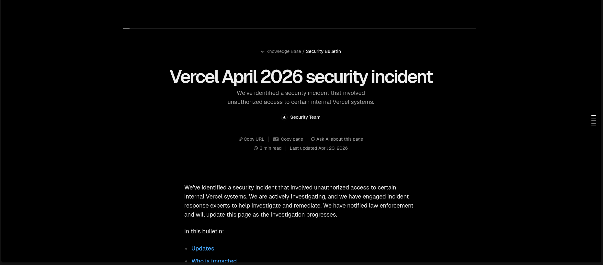

# Rotacione suas .env AGORA!

### 🔐 A vercel, plataforma de hospedagem foi hackeada

>  Tecnologia, Segurança, Vercel, Desenvolvimento

Se você acordou hoje com um frio na barriga ao abrir seu dashboard da Vercel, você não está sozinho. O incidente deste 20 de abril de 2026 não é apenas mais um "site fora do ar"; é um lembrete brutal de que o castelo de cartas das integrações SaaS pode desmoronar por causa de um único clique errado.

A Vercel confirmou que a confiança depositada em ferramentas de terceiros foi usada contra ela mesma, e seus segredos de produção podem estar na mesa de leilão de fóruns cibernéticos neste exato momento.
A Brecha: O "Efeito Dominó" do OAuth

O ataque não precisou quebrar a criptografia da Vercel. Os invasores encontraram o caminho mais fácil: a ferramenta de IA Context.ai. Através de uma falha de permissão no OAuth, os hackers conseguiram escalar privilégios e "sequestrar" sessões internas da equipe da Vercel.

O resultado? Acesso ao coração do gerenciamento de projetos. Isso significa que, por algumas horas, a linha entre o seu código privado e os atacantes simplesmente deixou de existir.
O que realmente está em jogo?

Esqueça a queda de tráfego. O perigo real mora nos seus arquivos de configuração:

Tokens do Stripe e AWS: Se o seu .env tem chaves com permissão de escrita, os invasores podem ter tido acesso a faturamentos e infraestruturas inteiras.

Injeção em Tempo de Execução: Durante o pico da invasão, domínios foram redirecionados. Usuários legítimos podem ter sido levados a espelhos de login projetados para coletar credenciais em massa.

Vazamento de Variáveis de Ambiente: Qualquer segredo que você injetou no seu projeto pode ter sido exfiltrado via logs de ferramentas de terceiros comprometidas.

Plano de Contingência: Faça isso nos próximos 10 minutos

Não espere a Vercel enviar um PDF de desculpas. A responsabilidade pela segurança dos seus dados finais agora é sua:

Mude TUDO: Vá até seus provedores de serviço (OpenAI, Stripe, Bancos de Dados) e revogue todas as chaves conectadas à Vercel. Gere novas e atualize o painel.

Verifique Tokens de Deploy: Revogue todos os seus VERCEL_TOKEN pessoais e de equipe no painel de configurações de conta.

Audite as "Zonas Mortas": Confira se existem novos membros na sua organização ou novos domínios configurados que você não autorizou.

A Lição de Hoje

O "Deploy em 1 clique" nos deu velocidade, mas o "Acesso via OAuth em 1 clique" pode ter nos custado a segurança. O incidente da Context.ai mostra que não importa o quão forte é o seu firewall se você entrega a chave da porta da frente para uma ferramenta de terceiros que você mal conhece.

A Vercel já isolou a ameaça e cortou os acessos da Context.ai, mas o que foi vazado não volta mais. A única solução é invalidar o que ficou para trás.

Mãos à obra. O tempo está correndo.

Fique alerta e mantenha seu ambiente trancado.
