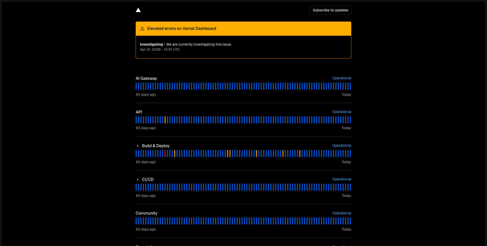

Novamente a Vercel passa por instabilidades, dessa vez, em partes da dashboard, em que algumas coisas não carregam. Mas não se assuste! Eles já estão investigando e a plataforma pode voltar ao normal daqui a algumas horas.

Não se preocupe!

Você não foi hackeado, é apenas uma instabilidade e não tem relação (talvez) com o problema que aconteceu no dia 20 (ontem), em uma newsletter em que falamos sobre o problema de forma menos técnica (rotacione suas .env agora!]([https://www.archgti.com.br/newsletter/a-vercel-plataforma-de-hospedagem-foi-hackeada](https://www.archgti.com.br/newsletter/a-vercel-plataforma-de-hospedagem-foi-hackeada))).

Você pode conferir o status da Vercel em [[www.vercel-status.com](http://www.vercel-status.com)]([https://www.vercel-status.com/](https://www.vercel-status.com/)).
