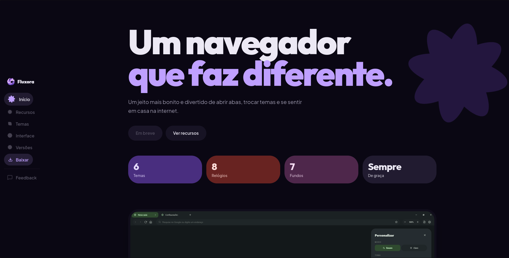
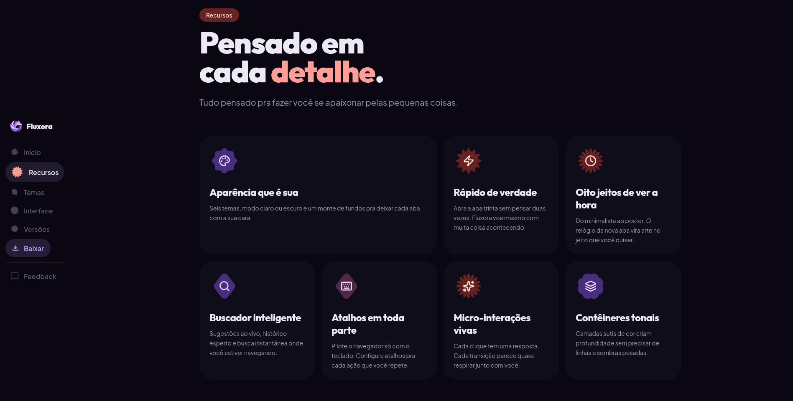

# Fala, arqueiros!

Começamos com a primeira edição do Achadinhos da Web, em que citamos e procuramos projetos interessantes por aí, desde tecnologia ou qualquer outra coisa que seja interessante.

No achadinho de hoje, temos o Fluxora: um navegador que faz diferente.

Fluxora é um navegador extremamente personalizável, e você pode deixá-lo do seu gosto, com a sua cara, para aumentar a produtividade ou por pura criatividade. Atualmente, o navegador está em fase de desenvolvimento e seu desenvolvedor publica diariamente atualizações sobre o processo na rede social Threads.

<blockquote class="text-post-media" data-text-post-permalink="https://www.threads.com/@ogabrielgmachl/post/DXeVlDREZdJ" data-text-post-version="0" id="ig-tp-DXeVlDREZdJ" style=" background:#FFF; border-width: 1px; border-style: solid; border-color: #00000026; border-radius: 16px; max-width:650px; margin: 1px; min-width:270px; padding:0; width:99.375%; width:-webkit-calc(100% - 2px); width:calc(100% - 2px);"> <a href="https://www.threads.com/@ogabrielgmachl/post/DXeVlDREZdJ" style=" background:#FFFFFF; line-height:0; padding:0 0; text-align:center; text-decoration:none; width:100%; font-family: -apple-system, BlinkMacSystemFont, sans-serif;" target="_blank"> 

 <svg aria-label="Threads" height="32px" role="img" viewBox="0 0 192 192" width="32px" xmlns="http://www.w3.org/2000/svg"> <path d="M141.537 88.9883C140.71 88.5919 139.87 88.2104 139.019 87.8451C137.537 60.5382 122.616 44.905 97.5619 44.745C97.4484 44.7443 97.3355 44.7443 97.222 44.7443C82.2364 44.7443 69.7731 51.1409 62.102 62.7807L75.881 72.2328C81.6116 63.5383 90.6052 61.6848 97.2286 61.6848C97.3051 61.6848 97.3819 61.6848 97.4576 61.6855C105.707 61.7381 111.932 64.1366 115.961 68.814C118.893 72.2193 120.854 76.925 121.825 82.8638C114.511 81.6207 106.601 81.2385 98.145 81.7233C74.3247 83.0954 59.0111 96.9879 60.0396 116.292C60.5615 126.084 65.4397 134.508 73.775 140.011C80.8224 144.663 89.899 146.938 99.3323 146.423C111.79 145.74 121.563 140.987 128.381 132.296C133.559 125.696 136.834 117.143 138.28 106.366C144.217 109.949 148.617 114.664 151.047 120.332C155.179 129.967 155.42 145.8 142.501 158.708C131.182 170.016 117.576 174.908 97.0135 175.059C74.2042 174.89 56.9538 167.575 45.7381 153.317C35.2355 139.966 29.8077 120.682 29.6052 96C29.8077 71.3178 35.2355 52.0336 45.7381 38.6827C56.9538 24.4249 74.2039 17.11 97.0132 16.9405C119.988 17.1113 137.539 24.4614 149.184 38.788C154.894 45.8136 159.199 54.6488 162.037 64.9503L178.184 60.6422C174.744 47.9622 169.331 37.0357 161.965 27.974C147.036 9.60668 125.202 0.195148 97.0695 0H96.9569C68.8816 0.19447 47.2921 9.6418 32.7883 28.0793C19.8819 44.4864 13.2244 67.3157 13.0007 95.9325L13 96L13.0007 96.0675C13.2244 124.684 19.8819 147.514 32.7883 163.921C47.2921 182.358 68.8816 191.806 96.9569 192H97.0695C122.03 191.827 139.624 185.292 154.118 170.811C173.081 151.866 172.51 128.119 166.26 113.541C161.776 103.087 153.227 94.5962 141.537 88.9883ZM98.4405 129.507C88.0005 130.095 77.1544 125.409 76.6196 115.372C76.2232 107.93 81.9158 99.626 99.0812 98.6368C101.047 98.5234 102.976 98.468 104.871 98.468C111.106 98.468 116.939 99.0737 122.242 100.233C120.264 124.935 108.662 128.946 98.4405 129.507Z" /></svg>

 Ver no Threads

</a></blockquote>

Ele é totalmente gratuito e tem diversos recursos que com certeza você usaria, além de ter otimização para suas pesquisas: sugestões ao vivo, histórico inteligente e busca totalmente rápida de qualquer parte que você estiver.

Explorando o projeto, ele usa base Chromium inicialmente; não temos mais informações se o desenvolvedor pretende mudar a base futuramente. O Chromium é uma base bastante utilizada em diversos navegadores por aí, como o Google Chrome, Brave, Microsoft Edge, além de outros projetos desconhecidos.

Chromium: sabe quando você usa o Google Chrome para ver desenhos ou jogos na internet? Imagine que o Chrome é um brinquedo montado, como um carrinho de controle remoto bem bonito que você compra em uma loja.

O Chromium é como se fosse o manual de instruções e todas as peças soltas desse carrinho (rodas, motor, volante, etc.).

De forma simples:

É a base: O Google pega as peças do Chromium (partes do carrinho), pinta de cores diferentes, coloca alguns adesivos extras e chama de Chrome.

Todo mundo pode usar: como as peças do Chromium ficam "abertas" no chão para qualquer um pegar, outras pessoas também podem criar seus próprios carrinhos usando as mesmas rodas e motores.

Resumindo: o Chromium é uma receita, o Chrome é o bolo pronto que a Google fez utilizando essa receita, e o navegador Fluxora também fez isso.

Na última atualização, o desenvolvedor adicionou novos temas, novas opções de personalização e recursos para bloqueadores de anúncios.

A UI/UX do navegador segue o estilo Material 3 Expressive, que, analisando profundamente, não achamos outro projeto que tenha as mesmas características desse, ou seja, é uma interface extremamente única e também compacta.

Você pode se tornar um testador do projeto nessa fase inicial, entrando em contato com o desenvolvedor [@ogabrielgmachl](https://www.threads.com/@ogabrielgmachl). O navegador ainda não foi lançado para todas as plataformas, mas, segundo o dev, ele está trabalhando em versões para Android e Linux.

Voce pode acompanhar todo o processo e lançamento pelo site do projeto ou pelas redes do criador dessa obra.

[Fluxora: um navegador que faz diferente.](https://www.seufluxora.com/)

Créditos ao [@ogabrielgmachl](https://www.threads.com/@ogabrielgmachl) no Threads.

ArchGTi parabeniza o criador do Fluxora pela criatividade aplicada no projeto.
