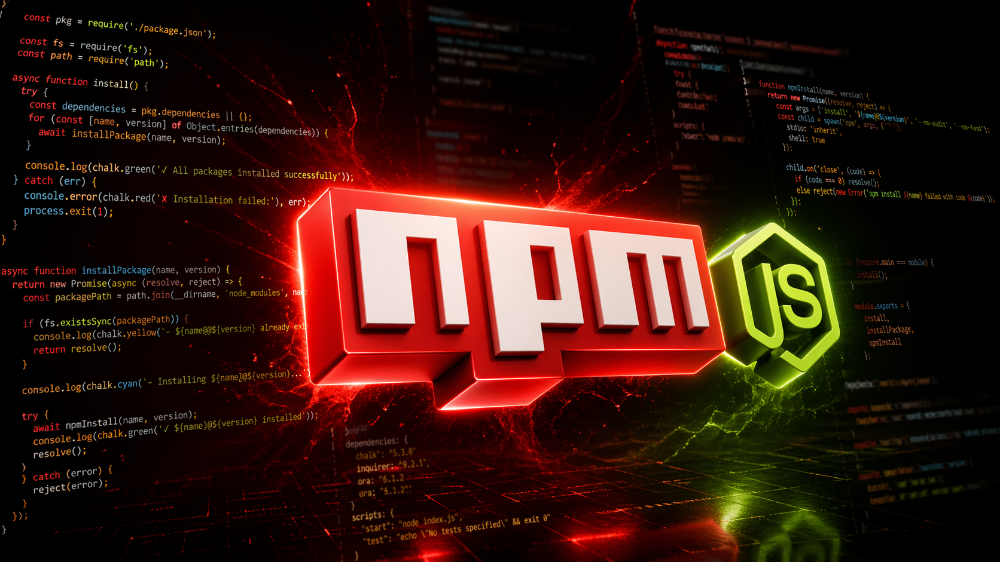

# 🔒 Cuidado! Pacotes maliciosos do NPM podem estar em seu projeto



Fala arqueiros! Na newsletter de hoje:

Mais uma vez foram identificados pacotes mal-intencionados no NPM, gerenciador de pacotes do Node.js.

Os pacotes maliciosos fazem roubo de credenciais do usuário ou do projeto em que você os instalou, capturando tokens JWT, tokens de serviços e APIs, entre outros.
Além disso, possuem comportamento destrutivo: o vírus se auto deleta, dificultando a identificação da sua presença e eliminando qualquer possibilidade de auditoria.

O cenário fica ainda pior quando isso vai para produção sem você perceber — podendo inclusive roubar credenciais dos seus próprios usuários.

---

Esse modelo de ataque (Supply-Chain Attack) ocorre quando atacantes comprometem componentes de terceiros, bibliotecas open source ou ferramentas de automação das quais um projeto Node depende.

Em vez de atacar diretamente a infraestrutura do alvo, eles infectam uma dependência confiável (similar ao caso recente envolvendo o Axios), que é baixada por milhares de desenvolvedores.

Ao menos **36 pacotes maliciosos** foram identificados no NPM, permitindo ataques remotos.

Esses scripts tinham comportamento de:

- Detectar credenciais
- Identificar serviços em execução
- Mapear integrações entre aplicações
- Acessar banco de dados
- Atuar tanto em ambiente local quanto em produção

**Essa prática reforça algo que muita gente deixou de lado**:

- Travamento de dependências (package-lock.json)
- Verificação de scripts (preinstall / postinstall)
- Atualizações feitas sem ler changelog
- Falta de validação da origem e integridade dos pacotes

---

### Como verificar e se prevenir?

Antes de tudo:

> Se você suspeita que foi vítima desse ataque:

- Pare tudo imediatamente
- Rotacione credenciais
- Invalide tokens de API
- Troque senhas
- Ative 2FA
- Use outro dispositivo
- Isole a máquina infectada da rede

Só depois disso, continue.

`1` - Verifique o nome correto do pacote `google-analytcs`

Exemplo:

```
google-analytics
gogle-analytics
google-analytcs
```

Atacantes exploram erro visual (typosquatting).

E sim: provavelmente você leu tudo como "google-analytics", inclusive o item `1`.

Leia de novo.

`2` - Durante e após a instalação: `--ignore-scripts`

Scripts maliciosos geralmente rodam no **postinstall**.

Use:

```sh
npm install <pkg-name> --ignore-scripts
```

Isso evita execução automática de código suspeito.

Importante: nunca ignore o `package-lock.json`.
Ele garante que todos usem exatamente as mesmas versões.

Em CI/CD:

`npm ci`

Mais rápido e mais seguro (respeita o lockfile).

3 - Verificação e auditoria de segurança

Execute regularmente:

``npm audit``

Para corrigir automaticamente:

``npm audit fix``

`4` - Snyk CLI (análise mais profunda)

Use ferramentas como o Snyk para análise contínua:

Instalação:

```sh
sudo npm i -g snyk
```

Autenticação:

```sh
snyk auth
```

Verificação:

```sh
snyk test
```

---

### Boas práticas para evitar problemas

- Mantenha dependências atualizadas (com validação)
- Não saia atualizando tudo no lançamento (evite “bleeding edge”)
- Leia changelogs
- Remova dependências que não usa
- Use 2FA (principalmente se você publica pacotes)

Seguindo esses passos você reduz drasticamente o risco de instalar pacotes maliciosos.

Se cuidem por aí.

Um forte abraço da ArchGTi.
